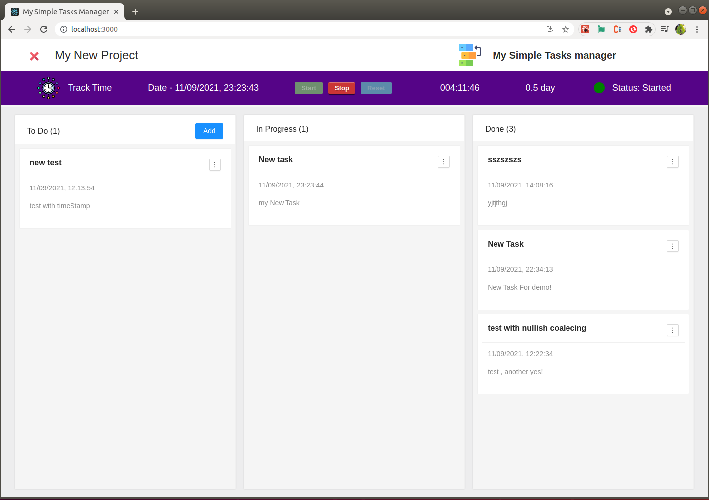

[](https://rodolphe-augusto.fr)
[](https://react-ultimate-messenger-documentation.netlify.app/)
[](https://app.netlify.com/sites/my-simple-tasks-manager/deploys)

# Tutorial Intro

---

## My Simple Task Manager

is a drag-and-drop task manager as well as a time tracker (not for a team, but for a single freelance developer for example)!

### This is a great little application when you are working alone on projects where you need to organize your tasks, as well as track the time you spend on a project to know the actual time you spent on it.


## Online Demo sites


**You can try My Simple Task Manager** **[here](https://my-simple-tasks-manager.netlify.app/)**,


>**This is Progressive Web App (PWA)**
You can easily install this application on a window, Mac or Linux computer.



this application is not responsive on mobile (as it is an application for people working in front of a computer - developer like me for example - I did not find useful to do media queries)


***(The demo is fully functional, all infos are stocked in localStorage)***

---

## Getting Started!

you just have to **clone this repository**.

---

## Install dependencies

On the root folder:

```shell
yarn
```
or
```shell
npm i
```
---

## Start the App

```shell
yarn start
```
or
```shell
npm start
```


Your site starts at `http://localhost:3000`.

---


* **Enjoy!**


---

## Author

- Thought, designed and developed with :purple_heart: by Rodolphe Augusto

---

## A few words from the author

Enjoy the World :smirk:

---

## :sparkling_heart: Support the project

I put almost everything open-source I can, and try to accommodate anyone who needs help using these projects. Obviously,
this takes time. You can use this service for free.

However, if you are using this project and are happy with it or just want to encourage me to keep creating: -

- Put a star and share the project :rocket:

Thank you! :heart:

---

## License

MIT

---

