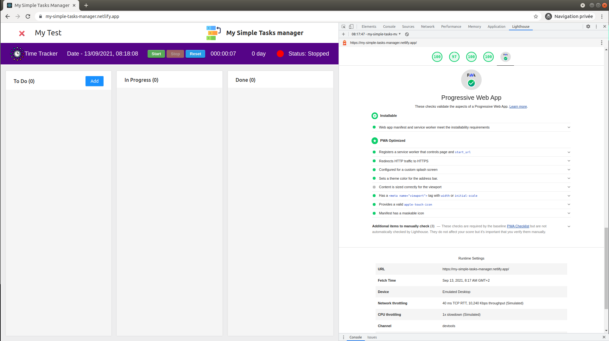
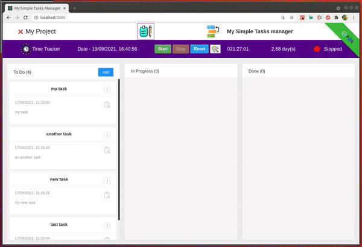
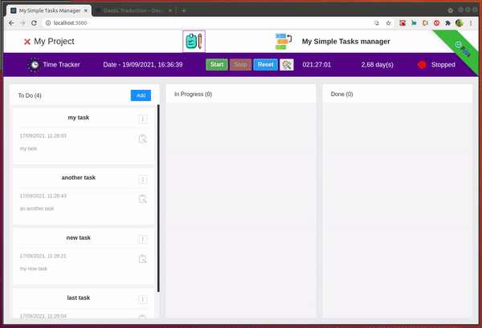
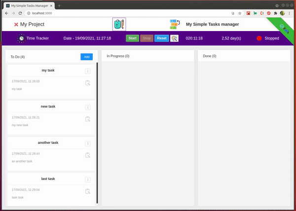
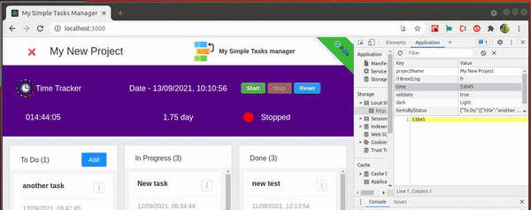

[](https://github.com/rodolphe37/my-simple-tasks-manager-/blob/main/LICENSE)
[](https://github.com/rodolphe37/my-simple-tasks-manager-/graphs/commit-activity)
[](https://github.com/rodolphe37/my-simple-tasks-manager-)
[](https://www.javascript.com/)
[](https://github.com/rodolphe37/my-simple-tasks-manager-/issues)
[](https://open.vscode.dev/rodolphe37/my-simple-tasks-manager-)
[](https://github.com/Naereen/badges/)


[](https://rodolphe-augusto.fr)
[](https://app.netlify.com/sites/stoic-swanson-4b33ba/deploys)

# Tutorial Intro

---

## My Simple Task Manager

is a drag-and-drop task manager as well as a time tracker (not for a team, but for a single freelance developer for example)!

### :bookmark: This is a great little application when you are working alone on projects where you need to organize your tasks, as well as track the time you spend on a project to know the actual time you spent on it.


## :computer: Online Demo sites


**You can try My Simple Task Manager** **[here](https://my-simple-tasks-manager.netlify.app/)**,


>**:heavy_check_mark: This is Progressive Web App (PWA)**



You can easily install this application on a Windows, Mac or Linux computer.

>Install on Ubuntu :heavy_check_mark:
>
>


>Install on Mac OSX :heavy_check_mark:
>
>

---
## UPDATE

---

### New Version (18 sept 2021 - ^V_1.6.0)

**:heavy_exclamation_mark: When you put the card on "In Progress" column**

>You have the day and the hour of the beginning of the treatment of the task to do.


---

**:heavy_exclamation_mark: When you put the card on "Done" column**

>In addition to the information of the beginning of the work on this card, the information of the end of the work is added.


---

**:heavy_exclamation_mark: If you work several times on the same card**

>The start/end information for each session is displayed.


---
**:heavy_exclamation_mark: If you put all the cards back in the "To Do" column**

>You will be asked if you want to reset the history of the time spent working on the cards!


---
**:heavy_exclamation_mark: I also added a "Sticky Notes or Post It" section**

>You can create up to 4 sticky notes in order to store all the information needed for the project and to access them at any time.!



---

### New Version (19 sept 2021 - ^V_1.7)

**:heavy_exclamation_mark: Time Tracker : Manual or automatic mode ?**

>A configuration button has been added to allow you to choose between two modes for the Time Tracker.


---

**:heavy_exclamation_mark: When you are in manual mode (default configuration)**

>The manual mode leaves the "Time Tracker" toolbar at the top of your page (header), This mode allows you to manage the time tracking independently from the task card dashboard..


---

**:heavy_exclamation_mark: When you click on the configuration button when you are in manual mode**

>A modal appears telling you which mode you are in and the possibility to change the default configuration to automatic mode.


---

**:heavy_exclamation_mark: When you are in automatic mode**

>The automatic mode moves the "Time Tracker" toolbar to the bottom of your page (footer). The management of the timer start/stop is done automatically depending on whether you are working on a task or not.


---
**:heavy_exclamation_mark: When you drag a task card into the "In Progress" column**

>The timer starts automatically...


---
**:heavy_exclamation_mark: Then, when you drag the card to the "Done" column**

>The timer stops automatically.!


---

**:heavy_exclamation_mark: When you click on the configuration button when you are in automatic mode**

>A modal appears showing you in which mode you are and the possibility to change the default configuration in manual mode.


---

**:heavy_exclamation_mark: You can only do one task at a time**

>If you drag more than one card into the "In Progress" column an alert informs you that it is not allowed and your card goes back to the box it came from automatically.



---

## END OF UPDATE New Version
---

**:heavy_exclamation_mark: When you want to delete the Project name!**

>You have two choices, delete only the project name or reset all (Project name, timer & all cards)



---

**:heavy_exclamation_mark: When you want to delete an task card!**

>You have one alert for confirm your wish to delete this card (with name card)


---

**:heavy_exclamation_mark: When you Start the counter!**

>The elapsed seconds are sent to the localstorage in real time, if you close the window inadvertently without stopping the counter, the elapsed time is automatically saved in the localStorage, adding to the time already present (seconds)!



---

**:x:** this application is  not responsive on mobile :mobile_phone_off: (as it is an application for people working in front of a computer - developer like me for example - I did not find useful to do media queries for that).


***(The demo is fully functional, all infos are stocked in localStorage)***

- Infos:
  - An input field, at the top right, is made to enter the name of the project you are working on!
  - 1 day of work is equivalent to 8 hours (28800 seconds)! (the calculation of the days worked in proportion to the passed seconds  is made with this logic - each 28800 elapsed seconds increment one day more)
  - When you start the counter, the seconds passed are sent to the localstorage in real time, when you stop the counter, the seconds passed add to the total and when you restart the counter, the count continues from this beginning.
  - When you click on reset button, it's reset the time in the state app & remove time to localStorage ( at each project beginning you can put to 0 the counter)
  - All the cards and their contents are synchronized with the localstorage.
  - The different states of the cards, according to the columns (To Do, In Progress, Done) are also synchronized with the localStorage.
  - You can delete only the project name or you can reset all things in the App (Project name, timer & all cards)


---
Can I use Compatibility:


## :microscope: Getting Started!

you just have to **clone this repository**.

---

## :satellite: Install dependencies

On the root folder:

```shell
yarn
```
or
```shell
npm i
```
---

## :rainbow: Start the App

```shell
yarn start
```
or
```shell
npm start
```


Your site starts at `http://localhost:3000`.

---


* **Enjoy!**


---

## :bust_in_silhouette: Author

- Thought, designed and developed with :purple_heart: by Rodolphe Augusto

---

## :large_blue_diamond: A few words from the author

Enjoy the World :smirk:

**:memo: To Do for the next version:**

>:bar_chart: Add a dashboard of statistics (number of tasks created for each day & total project tasks, time spent - with chronology (date - time - time spent for each work day), total number of hours on the project).

---

## :sparkling_heart: Support the project

I put almost everything open-source I can, and try to accommodate anyone who needs help using these projects. Obviously,
this takes time. You can use this service for free.

However, if you are using this project and are happy with it or just want to encourage me to keep creating: -

- Put a star and share the project :rocket:

Thank you! :heart:

---

## :scroll: License

MIT

---

