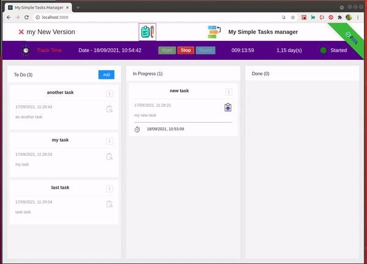

[](https://github.com/rodolphe37/my-simple-tasks-manager-/blob/main/LICENSE)
[](https://github.com/rodolphe37/my-simple-tasks-manager-/graphs/commit-activity)
[](https://github.com/rodolphe37/my-simple-tasks-manager-)
[](https://www.javascript.com/)
[](https://github.com/rodolphe37/my-simple-tasks-manager-/issues)
[](https://open.vscode.dev/rodolphe37/my-simple-tasks-manager-)
[](https://github.com/Naereen/badges/)


[](https://rodolphe-augusto.fr)
[](https://app.netlify.com/sites/my-simple-tasks-manager/deploys)

# Tutorial Intro

---

<div style="margin-left:40px; font-weigth:bold; font-size:24px; margin-top:-6px">My Simple Task Manager</div>

---

is a drag-and-drop task manager as well as a time tracker (not for a team, but for a single freelance developer for example)!

### This is a great little application when you are working alone on projects where you need to organize your tasks, as well as track the time you spend on a project to know the actual time you spent on it.





## Online Demo sites


**You can try My Simple Task Manager** **[here](https://my-simple-tasks-manager.netlify.app/)**,


>**This is Progressive Web App (PWA)**


You can easily install this application on a Windows, Mac or Linux computer.

>Install on Ubuntu
>
>


>Install on Mac OSX
>
>
---

>**When you want to delete the Project name!**
You have two choices, delete only the project name or reset all (Project name, timer & all cards)


---

>**When you want to delete an task card!**
You have one alert for confirm your wish to delete this card (with name card)


---

this application is not responsive on mobile (as it is an application for people working in front of a computer - developer like me for example - I did not find useful to do media queries)


***(The demo is fully functional, all infos are stocked in localStorage)***

- Infos:
  - An input field, at the top right, is made to enter the name of the project you are working on!
  - 1 day of work is equivalent to 8 hours! (the calculation of the days worked in proportion to the hours is made with this logic)
  - When you stop the counter, the seconds passed are sent to the localstorage, and when you restart the counter, the count continues from this beginning.
  - When you click on reset button, it's reset the time in the state app & remove time to localStorage ( at each project beginning you can put to 0 the counter)
  - All the cards and their contents are synchronized with the localstorage.
  - The different states of the cards, according to the columns (To Do, In Progress, Done) are also synchronized with the localStorage.
  - You can delete only the project name or you can reset all things in the App (Project name, timer & all cards)


---

## Getting Started!

you just have to **clone this repository**.

---

## Install dependencies

On the root folder:

```shell
yarn
```
or
```shell
npm i
```
---

## Start the App

```shell
yarn start
```
or
```shell
npm start
```


Your site starts at `http://localhost:3000`.

---


* **Enjoy!**


---

## Author

- Thought, designed and developed with :purple_heart: by Rodolphe Augusto

---

## A few words from the author

Enjoy the World :smirk:

---

## :sparkling_heart: Support the project

I put almost everything open-source I can, and try to accommodate anyone who needs help using these projects. Obviously,
this takes time. You can use this service for free.

However, if you are using this project and are happy with it or just want to encourage me to keep creating: -

- Put a star and share the project :rocket:

Thank you! :heart:

---

## License

MIT

---

